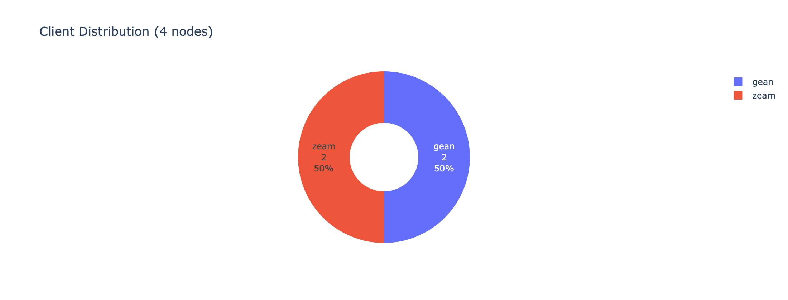
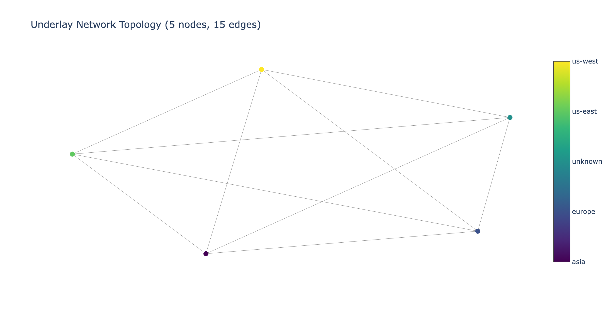

# 10. Multiple clients & subnets (interop)

This is the whole point of Shadow: **multiple clients on one network**, to catch interop bugs no
single-client testnet can. This chapter shows how to set up a multi-client sweep, what it proves,
and an honest account of the cost of running real multi-client XMSS on a laptop.

Because gean is single-subnet only (Chapter 9), any run that *includes gean* must use
`total_subnets = 1`. Multi-subnet interop is for clients that support it; mix gean in at one subnet.

## Setting up a multi-client run

Two things: add each client to `[clients]`, and make sure each has an arm64 `[client_images.<c>]`
and a `client-cmds/<c>-cmd.sh`. A zeam + gean run:

```toml
[client_images.gean]
image = "gean:shadow-base"
executable = "gean"

[client_images.zeam]
image = "blockblaz/zeam:devnet4"
executable = "zeam"

[simulation]
total_nodes = { min = 4, max = 4 }
total_subnets = { min = 1, max = 1 }     # gean requires 1
aggregators_per_subnet = { min = 1, max = 1 }

[clients]
gean = { min = 1.0, max = 1.0 }
zeam = { min = 1.0, max = 1.0 }          # equal weight → ~50/50, exact split varies by seed
```

The fuzzer pulls both images (`--platform linux/arm64`), bakes **both binaries** into one composite
Shadow image, and samples each node's client by weight. With equal weights and seed 44 we got a 2
gean + 2 zeam network:





## What the run proves (and it does work)

The composite image built cleanly with both clients, and under Shadow **both clients boot, join the
gossipsub topics, and peer with each other** — gean nodes form QUIC connections to zeam peers and
vice-versa. That cross-client peering is exactly the interop surface you want under test:

```
[gean-0] INFO [network] joining gossipsub topics
[gean-0] INFO [network] peer connected peer_id=16Uiu2HAm… direction=Outbound peers=1   # a zeam peer
[zeam-0]  zeam — a blazing fast lean consensus client   # booted alongside
```

So the multi-client **plumbing is correct end to end**: image composition, per-client launch
commands, shared genesis, cross-client discovery and gossip.

## The honest catch: wall-clock cost on a laptop

Shadow advances *virtual* time in lockstep across all hosts, and it runs the **real** XMSS prover
for every node. That means the simulation can only move as fast as the slowest prover on your
machine. A single-client gean run finishes in minutes; a mixed gean + zeam run, where every node is
doing real post-quantum proving, is **dramatically** more wall-clock-expensive — in our 4-node
attempt the simulated clock advanced only ~1.4 s of an 80 s run after several minutes of real time.
It boots and peers correctly; it just won't *reach finalization* in a reasonable time on a laptop.

This is not a gean bug and not a fuzzer bug — it's the nature of running real PQ crypto under a
lockstep simulator. The community runs these multi-client interop sweeps on **beefy Linux servers**
(where the same Zeam + Ethlambda + Lantern + gean configurations do finalize), not on laptops.

**Practical guidance:**

- On a **laptop**: use multi-client runs to validate *setup and interop plumbing* (images, peering,
  gossip) with tiny node counts and short durations; use **single-client** runs (Chapter 8) to get
  finalization and the full metric set.
- On a **Linux server**: scale up node counts and duration for real multi-client finalization
  sweeps. Everything in this guide applies unchanged; only the host changes.

## Making gean show up in multi-client stats: the parser

For gean's blocks and attestations to appear in `stats.json` (and thus the Observatory's
propagation/coverage charts), the fuzzer needs a **gean log parser**. Without it, the fuzzer falls
back to the zeam text parser, which can't read gean's log lines, and you get "No block events found"
even when gean finalized (finality still shows, because `chain_status` parsing is client-agnostic —
Chapter 11).

That parser, `shadow_fuzzer/clients/gean.py`, recognizes gean's log formats:

- `received block slot=N proposer=P …` → block received
- `publish gossip topic=…/block/… slot=N proposer=P … compressed_len=B` → block published (+ size)
- `attestation verified: validator=V slot=N` → attestation received (aggregators log these)
- `published attestation to network slot=N validator=V` → attestation published

It is registered in `shadow_fuzzer/clients/__init__.py` *before* the zeam fallback, and matches
hosts named `gean-*`. With it in place, a gean run's events populate the same charts every other
client's do — which is what makes a mixed gean + zeam run's Observatory page meaningful.

## Summary

| Aspect | Status |
|--------|--------|
| Multi-client image composition (gean + zeam) | ✅ works |
| Cross-client boot, discovery, gossip peering | ✅ works |
| gean events in stats (parser) | ✅ `clients/gean.py` |
| Multi-**subnet** with gean | ⛔ gean is single-subnet (Chapter 9) |
| Multi-client finalization on a **laptop** | ⚠️ too slow; use a Linux server |
| Multi-client finalization on a **server** | ✅ the community's standard setup |
