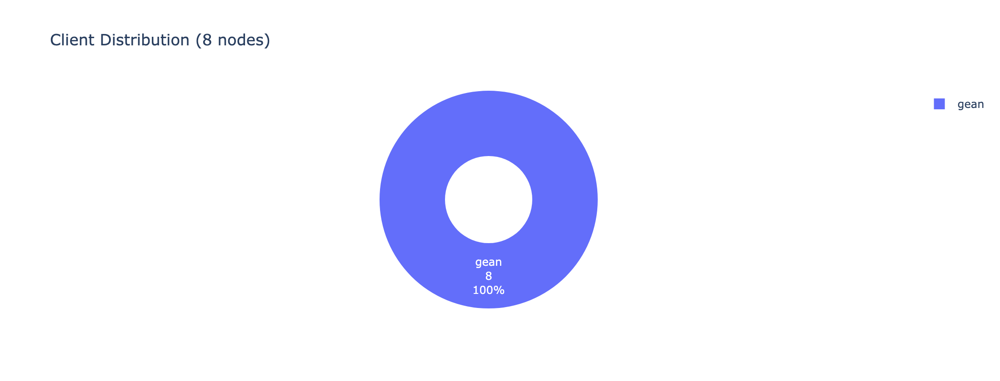
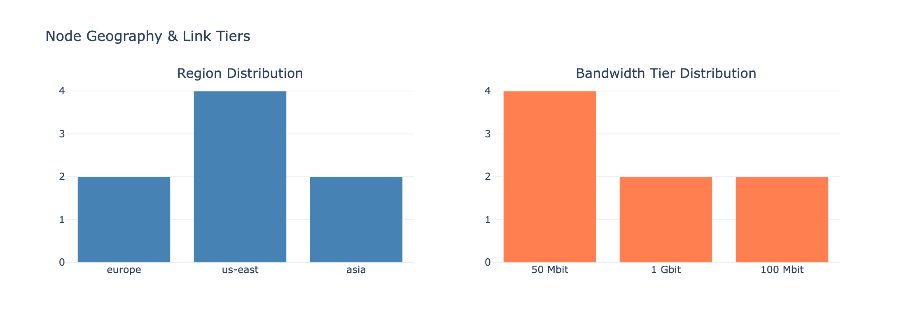
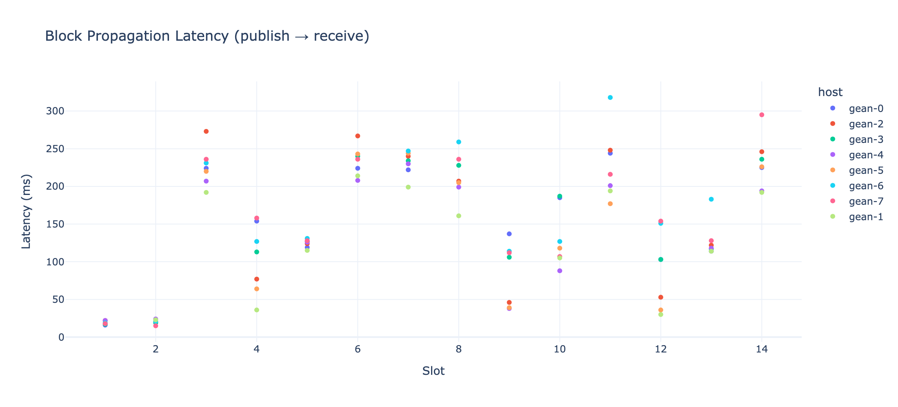
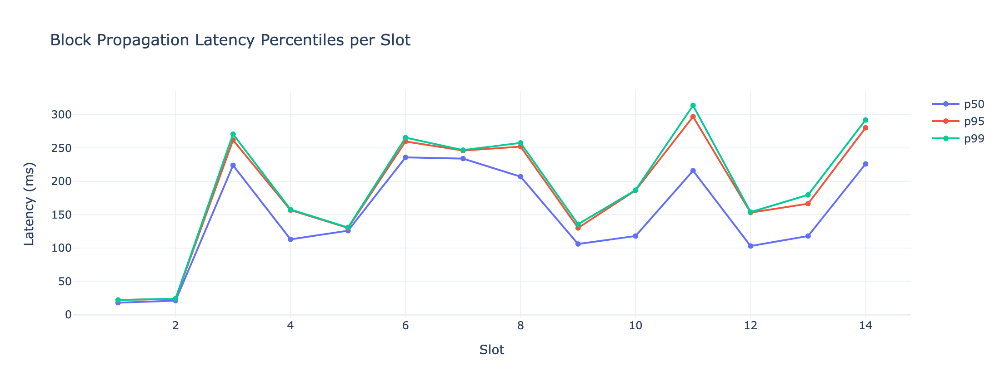
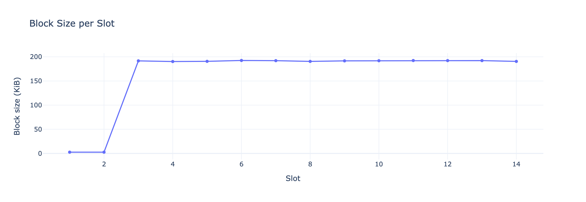
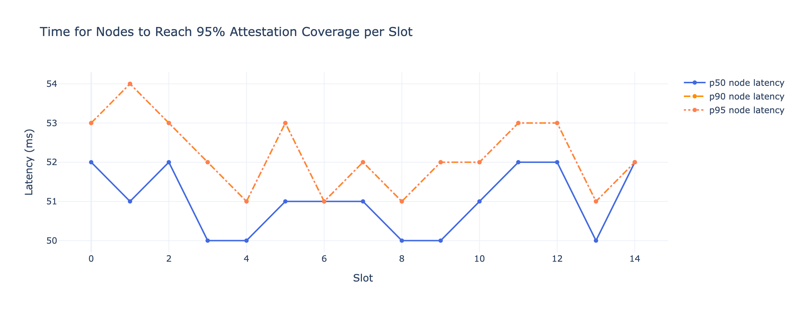
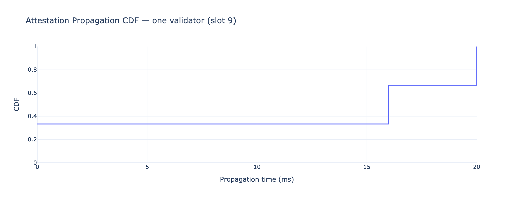
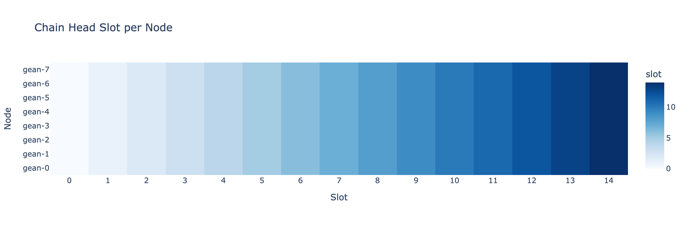
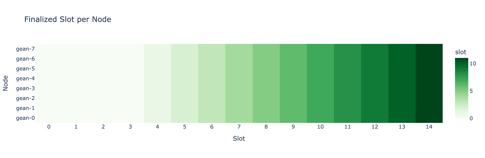
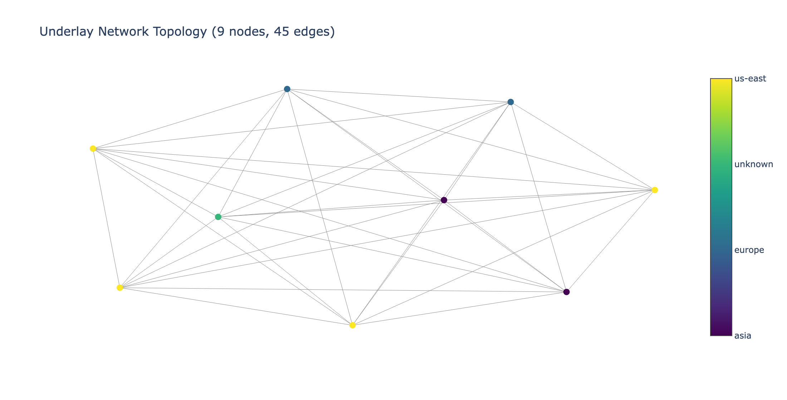

# 11. Reading the metrics

The Observatory page for a run is a Jupyter notebook (`notebooks/analysis.ipynb`) executed against
the run's `stats.json` and rendered to HTML. Every chart reads a specific field of `stats.json`,
which `shadow_fuzzer/stats_shadow.py` computed from the per-node logs. This chapter explains each
section so you can read a run at a glance. Images are from the reference gean run `hidden-hot-baboon`.

> **Timing convention.** All `*_ms` values are offsets from genesis in milliseconds. Under Shadow,
> "ms" is *virtual* time, so latencies reflect the simulated network + the modeled prover cost, not
> your laptop's speed.

## §1 Run overview

### Client distribution
`stats.node_distribution.clients` — how the `[clients]` weighted sampling actually landed this run.
A client can get 0 nodes; this tells you the real mix.

### Region & bandwidth tiers
`regions.json` / `bandwidths.json` — where nodes sit geographically and their link-speed tier.
These drive the latencies in the topology, so a run heavy in one slow region will show slower
propagation downstream.

### Gossipsub bandwidth by topic
`stats.bandwidth.slots` — total gossip bytes per topic (block / attestation / aggregation), split
by aggregator vs non-aggregator nodes. This quantifies the **extra load aggregators carry**: they
subscribe to and forward more. If this section says "No bandwidth events," the run didn't emit
Shadow bandwidth accounting (common for gean-only runs) — it's a data-availability gap, not a
network problem.

## §2 Block propagation

Reads `stats.blocks.slots`. For each slot: the proposer, the publish time, the block size, and each
host's first-receive time.

### Latency scatter
`latency_ms = receive_ms − published_ms` per host per slot — how long a block took from the
proposer's publish to each node seeing it.

### Percentiles per slot
p50 / p95 / p99 of those latencies grouped by slot. **p50 is the typical node; p99 is the
worst-case tail.** Watch p99 climb as you add nodes or slower links — it's the first sign of
propagation stress.

### Block size per slot
`block_size_bytes` over slots — block payload growth (e.g. as attestations accumulate).

## §3 Attestation coverage

### Coverage latency
`stats.attestations.coverage` — for each slot, the time for p50/p90/p95 of nodes to each have heard
**≥95% of that slot's published attestations**, measured from the first publish. The target is 95%.
**Rising p95 = stragglers**: some nodes are slow to reach near-complete attestation visibility.

### Per-validator propagation CDF
`stats.attestations.validator_propagation` — for one validator's attestation in a slot, the CDF of
how long it took to reach every node. A CDF that rises sharply then flattens near 1.0 = fast, even
propagation; a long flat tail = some nodes lag.

### Aggregated-attestation propagation CDF
`stats.attestations.aggregation_propagation` — same idea for an *aggregate* (committee-signed)
message, i.e. the thing aggregators produce. (For gean-only runs this can be empty if the parser
doesn't emit aggregation events yet — see Chapter 10. A run with finalization still proves
aggregates flowed, even when this specific chart is blank.)

## §4 Chain finality

Reads `stats.chain_status.slots` — each node's `head_slot`, `latest_justified_slot`, and
`latest_finalized_slot` per slot, parsed from the clients' "CHAIN STATUS" log lines. This section is
**client-agnostic** (it works for any client whose status lines match), so finality usually
populates even when event-level stats don't.

Two heatmaps — rows are nodes, columns are slots, color is the slot value:

**How to read them:** within a column, all nodes should show the same (or adjacent) color — that's
**agreement**. Left-to-right the colors should brighten steadily — that's **progress**. A row stuck
at a dark color while others advance is a **stalled or partitioned node**. A finalized heatmap that
never brightens means the chain **justified but never finalized** — the classic thing a Shadow run
is meant to catch.

This is the single most important panel: *if the finalized heatmap advances uniformly, the network
is healthy.*

## §5 Network topology

`topology.gml` rendered as a graph, nodes colored by region. This is the underlay Shadow used for
latencies — the structural map behind every propagation number above.

## Reading a run in 30 seconds

1. **Finalized heatmap** advancing uniformly? → network is healthy. (If not, stop here and debug.)
2. **Block propagation p99** flat and low? → gossip is keeping up.
3. **Attestation coverage p95** flat? → attestations reach nodes fast enough.
4. **Client distribution** matches what you intended? → the sampling did what you wanted.
5. **Warnings** section empty? → no data-collection gaps.

Everything else is detail you reach for when one of those five looks wrong.
